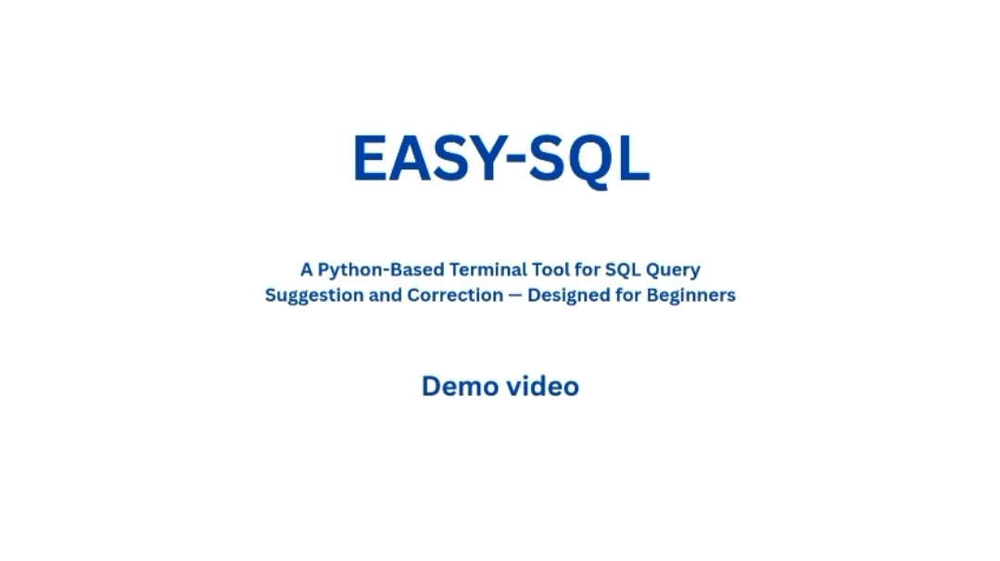

# EASYSQL: A Smart SQL Query Suggestion Tool

EASYSQL is a terminal-based tool designed to help beginners write correct SQL queries by offering real-time, schema-based suggestions and corrections. It simplifies learning SQL by guiding users through syntax, structure, and query construction using dynamic, context-aware suggestions.

---

## 🔍 Features

- 🧠 **Real-Time SQL Suggestions**: Offers context-aware recommendations based on live schema and user input.
- 🛠 **Automatic Query Correction**: Fixes syntax errors like missing semicolons, unmatched parentheses, and misused keywords.
- 📊 **Live Database Validation**: Suggests actual table and field names by connecting to a MySQL/MariaDB database.
- 🎓 **Beginner-Friendly**: Built for students and learners to understand and improve SQL writing.
- ⚙️ **Terminal-Based**: Lightweight and cross-platform—works on Windows CMD, Bash, and ZSH terminals.

---

## 📸 Screenshots

> 📌 **Suggestion Prompting**  
> Real-time keyword and clause suggestions as the user types.  
> 

> 📌 **Schema-Aware Completion**  
> Displays relevant table/column names pulled directly from the connected database.  
> 

> 📌 **Automatic Corrections**  
> Corrects syntax issues like missing semicolons or unmatched parentheses automatically.  
> 

---

## 🎥 Demo Video

Watch our demonstration video to see EASYSQL in action:

<video src="Images/demo.mp4" controls="controls" width="100%" style="max-width: 100%;">
  Your browser does not support HTML5 video player. <a href="Images/demo.mp4">Click here to view or download the video directly.</a>
</video>

*Note: If the video preview above does not load in your markdown editor, click the banner below to open the video:*

[](Images/demo.mp4)

---

## 📜 Patent Information

We are proud to announce that the EASYSQL system has been officially patented!

- **Title:** An IoT-enabled interactive system for real-time SQL suggestion and auto-correction
- **Application No:** 202631062458
- **Publication Date:** 11-09-2026
- **Date of Filing:** 17-05-2026


---

## 📚 Dataset

- **1400+ pre-constructed queries** based on core SQL operations:
  - `SELECT`: 300+  
  - `INSERT`: 150+  
  - `UPDATE`: 110+  
  - `DELETE`: 120+  
- Custom-built Query Ontology and Knowledge Graph.
- **Tools Used**: Protégé, ChatGPT (for refinement and structuring).

---

## 🧪 Technical Specifications

- **Language**: Python 3.6+
- **Libraries**: `prompt_toolkit`, `rich`, `os`, `re`, `pytest-shutil`
- **Supported Operating Systems**:
  - Windows 10/11
  - Ubuntu 20.04+, Manjaro Linux 25.0.0
- **Supported Databases**:
  - MySQL
  - MariaDB 11.7.2+
- **Minimum Requirements**:
  - 2 GB RAM
  - Python 3.6 or later

---

## 🏗 Architecture Overview

High-level architecture showing user interaction, suggestion engine, and database connection flow.  


---

## 🧩 Methodology

Includes use case diagrams, suggestion process logic, and backend workflow execution.  


*Basic suggestion and error correction engine flow:*  


---

## 🧱 Limitations

- Currently limited to **MySQL** and **MariaDB**.
- Dependent on pre-defined query ontology.
- Does not currently support graphical user interfaces (GUI) or natural language query parsing.

---

## 🚀 Future Scope

- PostgreSQL and Oracle DB integration
- Natural language to SQL query conversion (NL2SQL)
- Machine learning–powered suggestion engine
- Desktop GUI version for non-terminal users

---

## 💻 Installation

1. **Clone the repository:**
   ```bash
   git clone [https://github.com/Bibhas-Das/EASYSQL.git](https://github.com/Bibhas-Das/EASYSQL.git)
