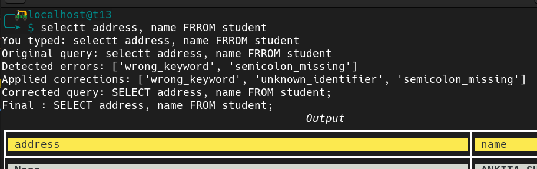
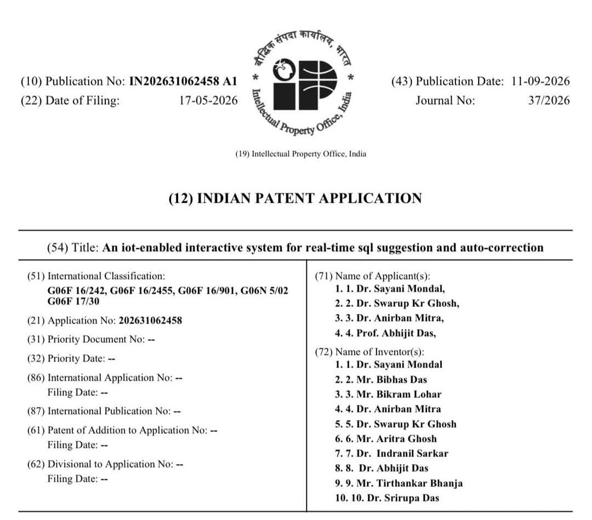
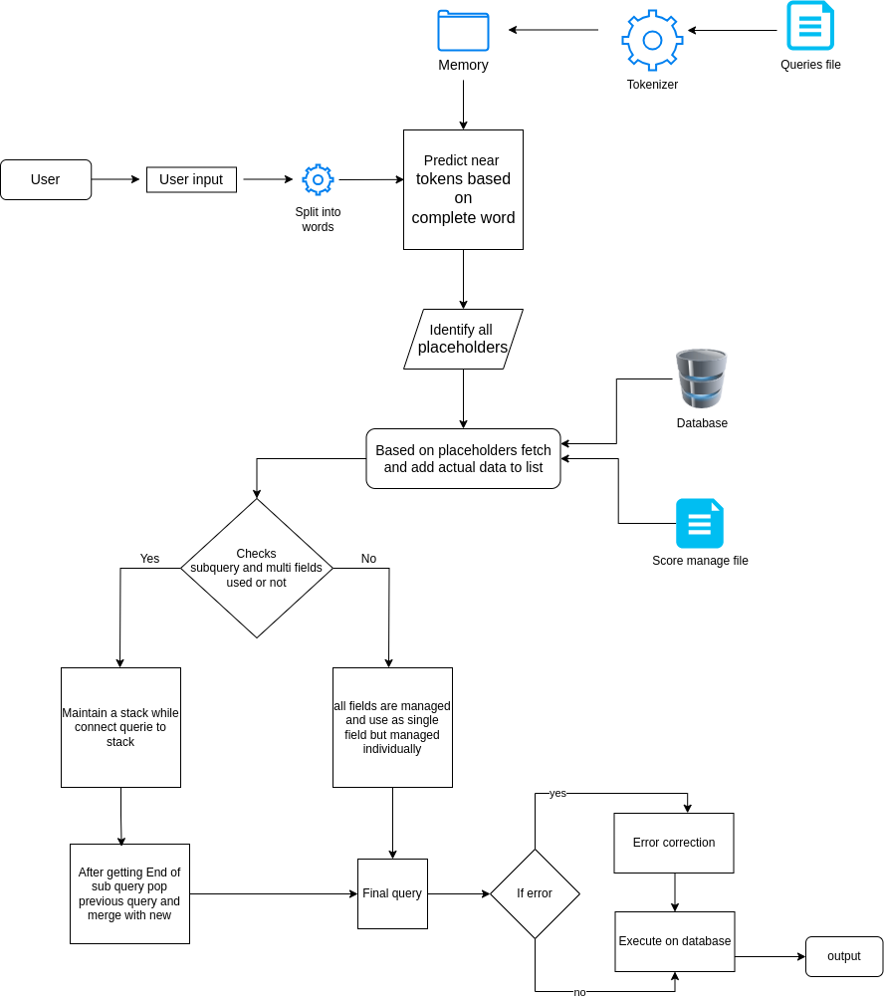
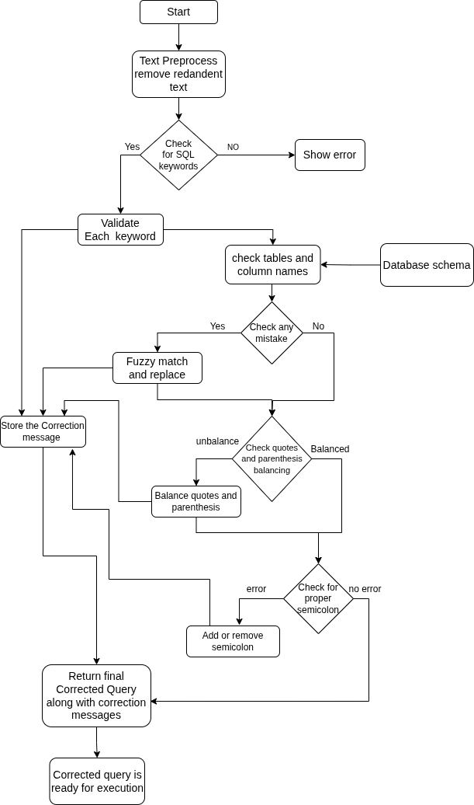

# EASYSQL: A Smart SQL Query Suggestion Tool

EASYSQL is a terminal-based tool designed to help beginners write correct SQL queries by offering real-time, schema-based suggestions and corrections. It simplifies learning SQL by guiding users through syntax, structure, and query construction using dynamic, context-aware suggestions.

---

## 🔍 Features

- 🧠 **Real-time SQL Suggestions**: Offers context-aware recommendations based on live schema and user input.
- 🛠 **Automatic Query Correction**: Fixes syntax errors like missing semicolons, unmatched parentheses, and misused keywords.
- 📊 **Live Database Validation**: Suggests actual table and field names by connecting to a MySQL database.
- 🎓 **Beginner-Friendly**: Built for students and learners to understand and improve SQL writing.
- ⚙️ **Terminal-Based**: Lightweight and cross-platform, works on Windows CMD, Bash, and ZSH terminals.

---

## 📸 Screenshots

> 📌 **Suggestion Prompting**  
Real-time keyword and clause suggestions as the user types.  


> 📌 **Schema-Aware Completion**  
Displays relevant table/column names pulled from the connected database.  


> 📌 **Automatic Corrections**  
Corrects syntax issues like missing semicolons or unmatched parentheses.  


---

## 🎥 Demo Video

Watch our demonstration video to see EASYSQL in action!

*(Note: Standard Markdown doesn't support embedding video players directly, but you can link an image to your video. Replace the links below with your actual YouTube/Vimeo links, or simply drag and drop your `.mp4` file directly into the GitHub editor to auto-generate a video player!)*

[](Images/demo.mp4)

---

## 📜 Patent Information

We are proud to announce that the EASYSQL system has been officially patented!

- **Title:** An iot-enabled interactive system for real-time sql suggestion and auto-correction
- **Application No:** 202631062458
- **Publication Date:** 11-09-2026
- **Date of Filing:** 17-05-2026



---

## 📚 Dataset

- 1400+ pre-constructed queries based on SQL operations.
  - `SELECT`: 300+  
  - `INSERT`: 150+  
  - `UPDATE`: 110+  
  - `DELETE`: 120+  
- Query ontology and knowledge graph built manually.
- Tools used: Protégé, ChatGPT for refinement and structure.

---

## 🧪 Technical Specifications

- **Languages**: Python 3.6+
- **Libraries**:
  - `prompt_toolkit`
  - `rich`
  - `os`, `re`, `pytest-shutil`
- **Supported OS**:
  - Windows 10/11
  - Ubuntu 20.04+, Manjaro Linux 25.0.0
- **Databases**:
  - MySQL
  - MariaDB 11.7.2
- **Minimum Requirements**:
  - 2 GB RAM
  - Python 3.6 or later

---

## 🏗 Architecture Overview

High-level architecture showing user interaction, suggestion engine, and database connection.  


---

## 🧩 Methodology

Includes use case diagrams, suggestion process logic, and backend workflow.  


Also prove basic suggestions 


---

## 🧱 Limitations

- Only supports **MySQL/MariaDB**.
- Dependent on pre-defined ontology.
- Does not currently support **GUI** or **natural language input**.

---

## 🚀 Future Scope

- PostgreSQL and Oracle DB support
- Natural language to SQL conversion
- Machine learning–based suggestion engine
- GUI version for non-terminal users

---

## 💻 Installation

* Download the repository

```bash
git clone https://github.com/Bibhas-Das/EASYSQL.git
```

Or download the Zip file

* Go to EASYSQL/install folder

```bash
cd EASYSQL/install
```

* There install.sh file is there just run it

```bash
sudo chmod +x install.sh
./install.sh
```

* It will automatically copy all necessary files and folders to /opt/easysql folder and configured.

* Just make sure that you already have a mysql/mariadb server installed in your system and has a database ready.

* [Optional] If you face trouble installing mysql/mariadb then go to the help folder and run the mysql_setup.sh

```bash
sudo sh mysql_setup.sh
```
It will download, setup, and import a dummy database.

* Provide the database user name, password, and database name.

* Then It is ready to run

```bash
easysql.sh
```

* You can run this application from anywhere via your terminal with your current user.
* All details and logs will be stored in that particular folder only. You can easily visit the location "/opt/easysql".

---

## 🗑️ Uninstallation

* To uninstall just remove the easysql folder from your system. 

```bash
sudo rm -r /opt/easysql
```

* And remove the line from your current shell rc file.

- First check your shell 
```bash
echo $SHELL
``` 
- As an example, if you use bash shell, then open the ~/.bashrc file from any text editor:

```bash
nano ~/.bashrc
```

- Remove the line from the bottom: "export PATH=/opt/easysql:$PATH"

- Then Ctrl+S to save
- And Ctrl+X to exit

* Now It is totally uninstalled from your system.

---

## 🙏 Acknowledgements

Developed under the guidance of **Dr. Sayani Mondal**, Assistant Professor, Department of Computer Science, Sister Nivedita University.

Special thanks to our families, peers, and academic mentors for their support and encouragement throughout this project.

---

## 📄 License

Copyright (c) 2025 Team EASYSQL (Sister Nivedita University)

This project is made available for **academic demonstration purposes only**.  
Redistribution, modification, or commercial use is **strictly prohibited** without prior written permission.

For licensing inquiries, please contact the authors.

---

## 📫 Contact

For questions, suggestions, or collaboration, please open an [Issue](https://github.com/yourusername/EASYSQL/issues) or contact any team member via GitHub.
